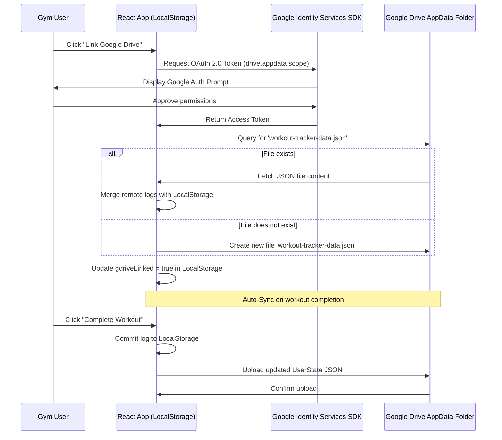

# Workout Tracker

A premium, client-side React web application designed to track P90X workouts over multiple 13-week (91-day) cycles. Hosted on GitHub Pages, the application stores data locally in the browser using versioned LocalStorage and syncs securely to Google Drive via OAuth for cloud backup.

---

## 📋 Table of Contents
1. [Core Features](#core-features)
2. [Tech Stack](#tech-stack)
3. [Project Directory Layout](#project-directory-layout)
4. [Data Schemas](#data-schemas)
5. [Google Drive Backup Sync Flow](#google-drive-backup-sync-flow)
6. [Design System & Aesthetics](#design-system--aesthetics)
7. [Testing Strategy (TDD)](#testing-strategy-tdd)
8. [Vercel React Best Practices Checklist](#vercel-react-best-practices-checklist)
9. [Setup & Running](#setup--running)

---

## 🚀 Core Features

1. **Manual Day Progression:** Track days 1–91 manually. Click "Complete Workout" to advance or click "Skip Day" for non-resistance cardio/stretching routines.
2. **Resistance Workout Sets Logging:** For lifting workouts (e.g., *Chest & Back*, *Shoulders & Arms*), log **Weight** and **Reps** separately for Round 1 (Set 1) and Round 2 (Set 2).
3. **Previous Performance Compare:** During logging, automatically display the weight and reps from the user's previous session for the same exercise and set, encouraging progressive overload.
4. **Historical Analytics:** Visual progress charts (using Chart.js) tracking strength and endurance progression across multiple 91-day cycles.
5. **No Global Workouts Timer:** Simple stopwatch/rest timers for lifting rest periods, with no global countdown timers for cardio/stretch workouts.
6. **Cloud & Local Storage Integration:** Client-side Google Drive API login for automated backup JSON syncing.

---

## 🛠️ Tech Stack

- **Framework:** React 18 / 19 (TypeScript)
- **Build Tool:** Vite
- **Styling:** CSS Variables (Vanilla CSS) with glassmorphism design tokens (backdrop-filters, blur, subtle dark gradients)
- **Charts:** Chart.js with standard React wrappers
- **Testing:** Vitest + React Testing Library (TDD approach targeting 100% coverage)
- **Authentication/Storage:** Google Identity Services (GIS) & Google Client Library (gapi) for Google Drive App Data folder integration

---

## 📂 Project Directory Layout

```text
workout-tracker/
├── Fitness Guide/           # Original PDF manuals & Excel worksheets
│   └── ...
├── src/
│   ├── components/          # Reusable UI Components
│   │   ├── Dashboard.tsx    # 13-week grid & phase overview
│   │   ├── WorkoutSession.tsx # Logging sheet (resistance / cardio inputs)
│   │   ├── HistoryCharts.tsx # Chart.js visualizations
│   │   ├── RestTimer.tsx    # Rest stopwatch/alert buzzer
│   │   └── Layout.tsx       # Main header, menu & cloud sync indicator
│   ├── contexts/
│   │   └── WorkoutContext.tsx # Global state context provider and reducers
│   ├── data/
│   │   └── schedule.ts      # Extracted P90X Classic schedule & exercises DB
│   ├── services/
│   │   ├── storage.ts       # LocalStorage wrapper & migrations
│   │   └── gdrive.ts        # Google Drive API auth & file sync module
│   ├── styles/
│   │   └── index.css        # Premium dark-mode glassmorphic styles
│   ├── App.tsx              # Main Router and view manager
│   └── main.tsx             # React DOM entry point
├── tests/
│   ├── storage.test.ts      # Unit tests for localstorage and migrations
│   ├── workout.test.ts      # State transition, skips, and cycle unit tests
│   └── components.test.tsx  # React component tests for logger / dashboard
├── vite.config.ts           # Vite + Vitest config
├── tsconfig.json            # TypeScript settings
└── README.md                # This file (Project reference documentation)
```

---

## 📊 Data Schemas

To facilitate multi-cycle tracking and extensibility, the state model separation is defined below:

```typescript
// Metadata structure for the workout program
export interface ExerciseInfo {
  id: string;        // e.g. "standard_pushup"
  name: string;      // e.g. "Standard Push-ups"
  type: "bodyweight" | "weighted";
  setCount: number;  // 1 or 2
}

export interface WorkoutInfo {
  id: string;        // e.g. "chest_and_back"
  name: string;      // e.g. "Chest & Back"
  type: "resistance" | "cardio" | "stretch";
  exercises: string[]; // List of ExerciseInfo IDs
  abRipper: boolean;  // True if Ab Ripper X is appended
}

// Logging structure for actual workouts
export interface SetLog {
  reps: number;
  weight: number;
  assisted: boolean; // True if using bands or chair
}

export interface WorkoutLog {
  id: string;        // UUID or `cycle_${cycle}_week_${week}_day_${day}`
  cycle: number;     // 1, 2, ... (multi-round support)
  week: number;      // 1-13
  day: number;       // 1-7
  workoutId: string; // e.g. "chest_and_back"
  dateCompleted: string; // ISO timestamp
  skipped: boolean;
  exercises: {
    [exerciseId: string]: SetLog[]; // Array matching exercise.setCount length
  };
  abRipperCompleted: boolean;
  comments: string;
}

// Root state schema stored in LocalStorage
export interface UserState {
  version: number;       // For migrations
  currentCycle: number;  // Active cycle
  currentWeek: number;   // 1-13 pointer
  currentDay: number;    // 1-7 pointer
  logs: WorkoutLog[];    // Historical logs across all cycles
  gdriveLinked: boolean; // Sync activated flag
}
```

---

## ☁️ Google Drive Backup Sync Flow

Since the application is serverless, the sync flow runs entirely client-side:



---

## 🎨 Design System & Aesthetics

The application implements a premium, dark-mode, mobile-first **glassmorphism** design:

- **Colors:** Deep obsidian backgrounds (`#0B0C10`), muted slate card wrappers with HSL translucency, and electric blue/violet accent gradients (`#1F2833`, `#45F3FF`, `#6F00FF`).
- **Typography:** Modern, clean fonts (Inter or Outfit) imported from Google Fonts.
- **Glass Effect:** `backdrop-filter: blur(12px) saturate(180%)` with ultra-thin semi-transparent borders (`rgba(255, 255, 255, 0.08)`).
- **Responsiveness:** Dynamic sizing adapted for smartphones and tablets. Large form inputs and buttons that are easy to press with sweaty fingers in the gym.

---

## 🧪 Testing Strategy (TDD)

We target **100% code coverage** for core state logic and services. We implement a Test-Driven Development workflow:

1. **Pure Reducer Testing:** Ensure `WorkoutContext` transitions state correctly for all actions: `START_SESSION`, `SAVE_SET`, `SKIP_DAY`, `COMPLETE_WORKOUT`, and `START_NEW_CYCLE`.
2. **Storage Migrations Testing:** Verify that old database schemas auto-migrate cleanly to newer formats.
3. **Component Interlocking:** Test component rendering under custom providers to ensure inputs, rest-timers, and previous-record badges render correctly.
4. **Mocks:** Mock `gapi` and LocalStorage APIs in Vitest to isolate component code.

To execute tests:
```bash
npm run test
```

---

## ⚡ Vercel React Best Practices Checklist

When modifying or writing code, adhere to these key performance practices:

- **Eliminate Rendering Waterfalls:** Put independent promise operations in `Promise.all` inside services.
- **Avoid Expensive Re-renders:** 
  - Wrap complex computations in `useMemo`.
  - Use `useCallback` for functions passed as props to memoized children.
  - Implement functional updates in state calls: `setState(prev => ...)` instead of depending on raw closures.
- **Local Storage Caching:** Read LocalStorage once during initialization using lazy state initialization:
  ```typescript
  const [state, setState] = useState(() => loadFromStorage());
  ```
- **Conditional Rendering:** Use React's ternary operators `condition ? <A /> : null` instead of logical AND `&&` to avoid accidental `0` or empty element rendering issues.

---

## 💻 Setup & Running

1. **Install Dependencies:**
   ```bash
   npm install
   ```
2. **Start Dev Server:**
   ```bash
   npm run dev
   ```
3. **Run Tests:**
   ```bash
   npm run test
   ```
4. **Production Build:**
   ```bash
   npm run build
   ```
